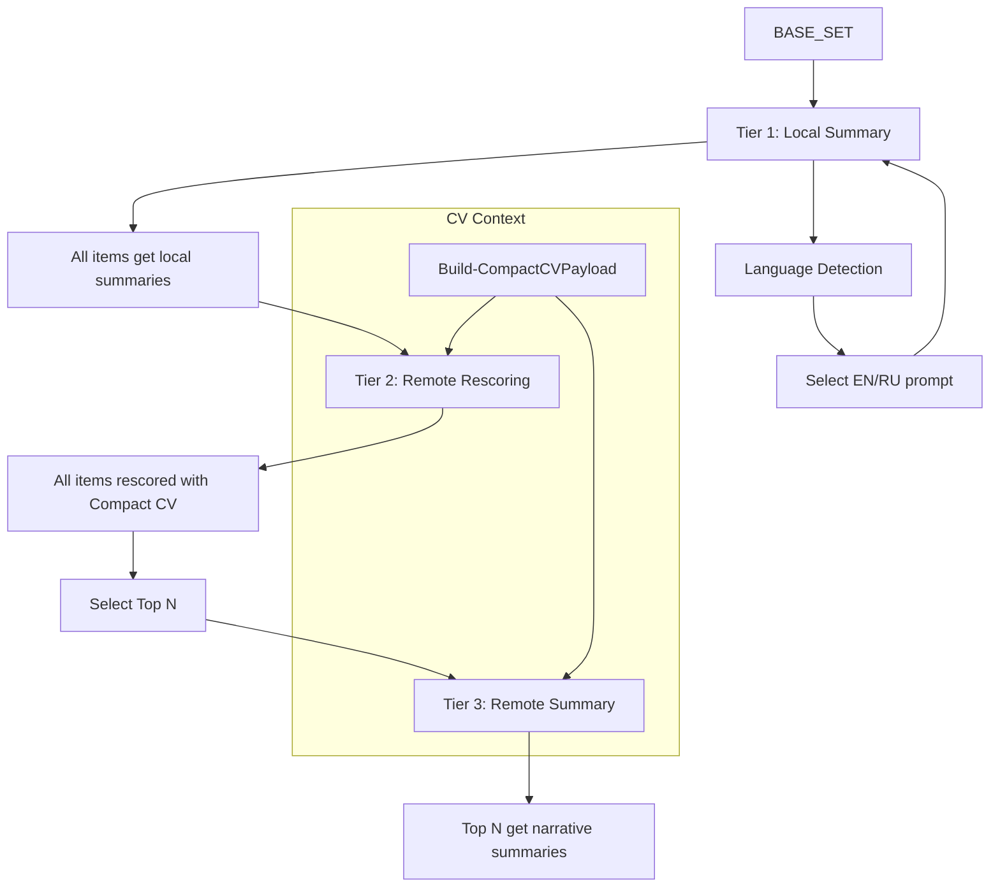

# System Design Document (SDD) — hh_probe
_Last updated: 2025-12-03_

## 1. Purpose

This SDD defines **HOW** hh_probe is built internally:

- Architecture.
- Modules.
- Data flows and contracts.
- Component responsibilities.
- Integration points.
- Invariants and constraints.
- Error handling, caching, rendering.

It is the source of truth for implementation work.  
All coding agents must follow this document; architecture changes require explicit human approval.

---

## 2. System Overview

hh_probe is a **PowerShell 7.5.4** modular system designed as a single, deterministic pipeline:

hh.ps1 (entrypoint)
    → hh.config
    → hh.util
    → hh.core
    → hh.fetch → hh.http → hh.cache
    → hh.skills
    → hh.scoring
    → hh.llm / hh.llm.local
    → hh.pipeline
    → hh.report
    → hh.render
    → hh.notify

It interacts with:
	•	HH.ru API (vacancies, resumes, similar vacancies, negotiations, views/invites).
	•	LLM providers (remote + local).
	•	LiteDB (cache).
	•	Telegram Bot API (notifications).
	•	MCP Memory Graph (project "brain", outside the repo).

⸻

## 3. Architectural Style

- **Modular PowerShell design.**
- **Single entrypoint:** `hh.ps1` (plus optional alias `hhr.ps1`).
- **Pull-based pipeline** (data flows through stages; pipeline state object coordinates).
- **Typed core models** — CanonicalVacancy & related types.
- **Persistent caching** — LiteDB-first.
- **Template-based rendering** — Handlebars.Net.
- **Memory-led governance** — MCP Memory Graph documents architecture and phases.

---

## 4. Modules

### 4.1 hh.ps1 — Entrypoint / Orchestrator

**Responsibilities:**
- Parse CLI arguments (e.g., `-Digest`, `-LLM`, `-SyncCV`, `-NotifyDryRun`, `-Limit`, `-WhatIfSearch`).
- Import and initialize modules in correct order (`hh.util` first).
- Resolve configuration via `hh.config`.
- Initialize pipeline state (`hh.core`).
- Initialize cache (`hh.cache`).
- Orchestrate:
  - HH fetch (Web Recommendations + Similar + General).
  - Getmatch parallel fetch.
  - Detail retrieval.
  - Skills analysis.
  - Scoring.
  - Three-tier LLM processing.
  - Canonical + projection builds.
  - Rendering (JSON/CSV/HTML).
  - Notifications.
  - CV bump (if enabled).
- Trigger MCP Memory Graph updates via external MCP client or integration layer.

**Invariants:**
- No heavy business logic (delegate to modules).
- No extra entrypoints or duplicate orchestration scripts.

---

### 4.2 hh.config.psm1 — Configuration Layer

**Responsibilities:**
- Load `config/hh.config.jsonc`.
- Provide accessors:
  - `Get-HHConfig`
  - `Get-HHConfigValue`
  - `Get-HHSecrets`
- Overlay secrets from environment (tokens, API keys) on top of config.

**Invariants:**
- Only one config file.
- JSONC only (comments allowed).
- No runtime config mutations except in tests.

---

### 4.3 hh.core.psm1 — Pipeline State & CV Management

**Responsibilities:**
- Define and manage `HHPipelineState`:
  - Stats (counts of vacancies, LLM calls, cache hits).
  - Run metadata (timestamp, mode, run id).
- Provide helpers:
  - `New-HHPipelineState`
  - `Set-HHPipelineValue`
  - `Add-HHPipelineStat`.
- Implement CV bump logic:
  - Determine if CV bump is allowed (weekday + 4h gating).
  - Call HH API via `hh.http` for `resumes/{id}/publish`.

**Invariants:**
- No direct external API calls (delegated to `hh.http`).
- State mutated only via explicit functions.

---

### 4.4 hh.util.psm1 — Utility Module

**Responsibilities:**
- Repo discovery: `Get-RepoRoot`, `Join-RepoPath`.
- Date/time utilities: `Get-UtcDate`, conversions (UTC-first).
- Search helpers: `Build-SearchQueryText`.
- File-locking: `New-FileLock`.
- **Language detection:** `Detect-Language` — Cyrillic vs Latin character analysis with 60% threshold.
- **Summary language resolution:** `Resolve-SummaryLanguage` — uses `Detect-Language`.
- Misc convenience functions (logging helpers, path helpers, etc.).

**Invariants:**
- Imported first.
- No domain business logic.
- No external HTTP calls.

---

### 4.5 hh.http.psm1 — HTTP Access & Rate Limiting

**Responsibilities:**
- Wrap `Invoke-RestMethod` / `Invoke-WebRequest`.
- Handle:
  - Rate limits.
  - Request pacing.
  - Max concurrency.
  - Retry-After, transient errors.
  - Standard headers (auth, user-agent, etc.).

**Invariants:**
- All external HTTP for HH, LLM, Telegram goes through here (or a thin wrapper).
- No higher-level business logic (payload semantics stay in caller modules).

---

### 4.6 hh.fetch.psm1 — HH API Fetch Layer

**Responsibilities:**
- **Hybrid Search Orchestration:**
  - **Stream HH (Sequential):**
    - `Get-HHWebRecommendations` — Scrapes `hh.ru/search/vacancy?resume={id}` using `hhtoken` cookie (URLs only).
    - `Get-HHSimilarVacancies` — `/resumes/{id}/similar_vacancies`.
    - `Search-Vacancies` — `/vacancies` with Smart Search filters.
  - **Stream Getmatch (Parallel):**
    - `Get-GetmatchVacancies` — Fetches from Getmatch.ru with independent rate limiting.
  - `Get-HHHybridVacancies` — Orchestrates parallel streams, handles internal HH dedup, sets `SearchTiers`.
- `Fetch-Resumes` — `/resumes/mine`.
- `Fetch-ViewsForResume` — resume viewers.
- `Fetch-Invites` — negotiations/invites.
- `Get-VacancyDetail` — `/vacancies/{id}`.

- **Currency Fetching:**
  - `Get-ExchangeRates` — Fetches currency rates (e.g., from CBR daily JSON) and caches them via `hh.cache`.
  - Returns a hashtable with ISO currency codes as keys and numeric rates as values, normalized to the configured base currency (e.g., `@{ RUB = 1.0; USD = 95.5; EUR = 101.2 }`).
  - MUST be called once per run and reused across the scoring phase (no per-vacancy HTTP calls).

**HH Vacancy Identity & URL Handling:**  
- Web Recommendations scraping MUST collect vacancy **URLs only** from `hh.ru/search/vacancy?resume={id}` and immediately normalize them to numeric vacancy IDs (parsed from `https://hh.ru/vacancy/{id}` or equivalent patterns).  
- Similar and General search MUST use the numeric `id` and `alternate_url` fields returned by the HH API as the single source of truth for HH vacancies.  
- Within the HH stream, deduplication MUST be performed **strictly by numeric vacancy ID**, not by URL string.  
- All canonical HH vacancy fields (title, description, key_skills, salary, employer, area) MUST come **only** from the `GET /vacancies/{id}` API via `Get-VacancyDetail`.  
- Vacancy listing HTML pages MUST NOT be scraped for canonical enrichment (they may only be used for debugging or diagnostics in future tooling, not for data feeding the pipeline).

**Strict/WhatIf Mode Support:**
- In **Strict Mode:** Uses only CV skills for search; ignores `search.keyword_text`.
- In **WhatIf Mode:** Uses only manual keywords for search; ignores CV skills.

**Invariants:**
- No scoring or LLM logic.
- No direct file or DB I/O (outside cache usage if needed).
- Uses `hh.http` exclusively for network calls.
- HH and Getmatch run in parallel with independent rate limits.
- No dedup between HH and Getmatch at fetch level.
- HH identity is always the numeric vacancy ID; Web Recommendations URLs must be normalized to IDs as early as possible.  
- Canonical HH vacancy data is populated exclusively from `Get-VacancyDetail` (`/vacancies/{id}`); listing HTML is never used as a data source.

---

### 4.7 hh.cache.psm1 — LiteDB Cache

**Responsibilities:**
- Initialize LiteDB (path from config).
- Provide simple key/value APIs:
  - `Initialize-HHCache`
  - `Get-HHCacheItem`
  - `Set-HHCacheItem`
  - `Remove-HHCacheItem`
  - `Remove-HHCacheOlderThanDays`.
- Handle TTL on read and prune.

**Invariants:**
- LiteDB is primary backend.
- File caches appear only where explicitly designed (mostly legacy LLM text fallback).
- No business logic in this module.

---

### 4.8 hh.skills.psm1 — Skills Intelligence

**Responsibilities:**
- Extract skills from:
  - HH `key_skills` array.
  - Vacancy description text.
  - User CV / skills vocabulary.
- Construct `SkillsInfo` structure:
  - `Score`
  - `MatchedVacancy[]`
  - `Present[]`
  - `Recommended[]`.
- Compute skill popularity metrics across runs (if enabled).

**Invariants:**
- Output arrays must never be null.
- No LLM calls from this module.

---

### 4.9 hh.scoring.psm1 — Heuristic Scoring Engine

**Responsibilities:**
- Implement a **Heuristic Gating** layer that computes a fast, deterministic relevance score used only for:
  - Selecting the `BASE_SET` of vacancies for downstream enrichment and LLM ranking.
  - Tie-breaking when remote LLM scores are equal.
- Expose two primary entrypoints:
  - `Test-IsHardFiltered` — early, boolean deal-breaker check.
  - `Get-HeuristicScore` — main numeric score calculator.

**Functions:**

- **`Test-IsHardFiltered`**
  - **Inputs:** `CanonicalVacancy`, `Config`, optional user preferences (e.g., remote-only).
  - **Behavior:**
    - Returns `$true` when a vacancy must be discarded *before* scoring and enrichment, for example:
      - Employer is in `scoring.filters.blacklist_employers`.
      - Vacancy schedule/location conflicts with `preferences.remote_only` or similar hard preferences.
    - Returns `$false` otherwise.
  - **Usage:**
    - Called by `hh.pipeline` before invoking `Get-HeuristicScore`.
    - Vacancies with `Test-IsHardFiltered = $true` MUST NOT enter `BASE_SET`.

- **`Get-HeuristicScore`**
  - **Inputs:** `CanonicalVacancy`, compact CV profile (skill set / experience), `Config`, and a pre-fetched `ExchangeRates` hashtable from `hh.fetch:Get-ExchangeRates`.
  - **Output:** Deterministic numeric score in `[0.0 .. 1.0]`.
  - **Components (mapped to `MetaInfo.Scores` where applicable):**
    1. **Skills Component** (exposed as `meta.scores.skills`):
       - Uses normalized skill tokens (via `hh.util`) from both CV and vacancy.
       - Measures overlap as a combination of:
         - “How much of CV is covered by vacancy” and
         - “How much of vacancy requirements are covered by CV”.
    2. **Salary Component** (exposed as `meta.scores.salary`):
       - Salary ranges are normalized to a configured base currency using `ExchangeRates`.
       - Applies “hidden salary” nuance:
         - Missing/hidden salary on trusted sources (e.g., Getmatch or Senior HH roles) yields a neutral-to-positive score.
         - Explicit lowball offers (below user expectation in base currency) yield a 0.0 component.
    3. **Experience Component** (exposed as `meta.scores.seniority` or equivalent):
       - For HH vacancies, maps `experience.id` buckets to CV experience and scores:
         - Exact bucket match = high score.
         - Adjacent bucket = partial score.
         - Mismatch = low/zero score.
       - For sources where filtering already enforced experience (e.g., Getmatch), may default to a high score.
    4. **Recency Component** (exposed as `meta.scores.recency`):
       - Computes a decay based on days since publication (e.g., `exp(-days/tau)`).
       - Missing dates (evergreen postings) use a neutral default.
    5. **Total Heuristic Score** (`meta.scores.total`):
       - Weighted sum of the components above, with weights defined in `config/hh.config.jsonc` (e.g., skills / salary / experience / recency).
       - Used for gating (`BASE_SET` selection) and, optionally, for tie-breaking when remote LLM scores are equal.

**Invariants:**
- **Pure & Deterministic:**
  - No HTTP calls, no file or DB access; all external data (exchange rates, config, CV profile) is passed in by the caller.
  - Same inputs MUST always produce the same outputs.
- **Currency-Aware:**
  - All salary comparisons and thresholds MUST use the injected `ExchangeRates` object; no hard-coded currency rates are allowed in this module.
- **Gating Only:**
  - Remote LLM scores (`ranking.remote`) provide the final ranking for reports; heuristic scores are used strictly for:
    - Selecting the `BASE_SET` and
    - Tie-breaking where needed.
- **No LLM Logic:**
  - This module MUST NOT call any LLMs (local or remote) and MUST NOT depend on `hh.llm` or `hh.llm.local`.

---

### 4.10 hh.llm.psm1 — Remote LLM Integration

**Responsibilities:**
- Call remote LLM via generic OpenAI-compatible interface (model-agnostic).
- **Logical Operations Routing:**
  - `Resolve-LlmOperationConfig` — Maps logical operations to providers:
    - `summary.local` → local LLM (via `hh.llm.local`)
    - `ranking.remote` → remote LLM for rescoring
    - `summary.remote` → remote LLM for narrative summaries
    - `picks.why.ec`, `picks.why.lucky`, `picks.why.worst` → pick explanations
    - `culture_risk` → culture risk assessment
- **Prompt Management:**
  - Reads prompts from `llm.prompts.summary.remote|local` (EN/RU variants) and `llm.prompts.<operation>`.
  - Applies language selection (EN/RU) based on `Detect-Language`.
  - Falls back through `system_en` → `system_ru` → hardcoded default.
- **Compact CV Integration:**
  - `Invoke-PremiumRanking` — Accepts CanonicalVacancy + Compact CV Payload for rescoring.
- Use `hh.cache` to cache prompts/responses.
- Support metrics: number of calls, cache hits, skips.

**Invariants:**
- Handles failures gracefully for summaries only; pick "why" has NO fallback (empty when unavailable).
- Never writes HTML; only returns plain strings or structured objects.
- No direct file I/O outside cache use.
- No provider-specific logic (e.g., no "if deepseek" blocks); purely configuration-driven.
- **Pipeline code MUST NOT reference model names.**
- Every logical LLM operation records telemetry via `Add-LlmUsage` (calls/tokens/cost).

---

### 4.11 hh.llm.local.psm1 — Local LLM Integration

**Responsibilities:**
- Talk to local model (e.g., Ollama gemma3:1b).
- Provide relevance score (e.g., 0–5).
- Provide short summary text.
- Use language-specific prompts from config (`llm.prompts.summary.local.system_en|system_ru`).
- Degrade gracefully when local model is unavailable.

**Invariants:**
- Must support test stubs (no real LLM calls in tests).
- Works as first tier in LLM tiered strategy when enabled.

---

### 4.12 hh.pipeline.psm1 — Canonical Pipeline Builder

**Responsibilities:**
- **Heuristic Gating & BASE_SET Selection:**
  - At pipeline initialization, call `Get-ExchangeRates` (via `hh.fetch`) once and store rates in pipeline state.
  - For each ingested vacancy:
    - Run `Test-IsHardFiltered`; discard vacancies where it returns `$true`.
    - For remaining vacancies, call `Get-HeuristicScore`, injecting the cached `ExchangeRates`.
  - Sort remaining vacancies by heuristic score and compute `BASE_SIZE = report.max_display_rows × ranking.candidate_multiplier`.
  - Select the top `BASE_SIZE` vacancies as `BASE_SET`; only `BASE_SET` proceeds to detail enrichment and LLM tiers.
- **Three-Tier LLM Orchestration:**
  - **Tier 1 (Local Summary):** Runs for all `BASE_SET` items via `hh.llm.local`.
  - **Tier 2 (Remote Rescoring):** Runs for all `BASE_SET` items via `hh.llm` (`ranking.remote`).
  - **Tier 3 (Remote Summary):** Runs for final top N items via `hh.llm` (`summary.remote`) where N = `llm.tiered.top_n_remote`.
- **Picks Selection:**
  - Select EC (requires successful external LLM).
  - Select Lucky (requires successful random.org selection).
  - Select Worst (LLM OR fallback to lowest score).
- **Unified Resume ID Resolution & Reuse:**
  - Priority: CLI → Config → Auto-detect.
  - Single source-of-truth reused across all stages.

**Invariants:**
- Always returns typed canonical objects.
- Uses a single, cached `ExchangeRates` snapshot per run for all heuristic scoring (no per-vacancy currency HTTP calls).
- No partial or inconsistent canonical states.
- Publishes per-operation LLM usage stats in `PipelineState.LlmUsage`.
- No HTML or projection-level concerns.

### Source-Aware Detail Enrichment

The detail-fetch stage MUST respect source type:

- If `vac.Meta.Source == 'hh'`, call `Get-VacancyDetail` (HH API).
- If `vac.Meta.Source != 'hh'`, skip HH detail fetch.

Rationale:
- Getmatch IDs (e.g., gm_12345) are not resolvable via HH API and produce 404s.
- Detail enrichment for external sources will be added only via their own dedicated fetchers.
- This rule ensures no cross-source API misuse.

---

### 4.13 hh.report.psm1 — Projection Layer

**Responsibilities:**
- Transform `CanonicalVacancy` → flat projection rows for reports:
  - Plain types (strings, numbers, arrays).
- Compute:
  - Display score,
  - Tooltips,
  - Tags,
  - Picks markers.

**Invariants:**
- Does not alter canonical objects.
- No new domain business rules; only formatting/flattening.

---

### 4.14 hh.render.psm1 — Rendering

**Responsibilities:**
- Use Handlebars.Net templates to produce:
  - `hh.html` HTML report (mobile-responsive, horizontal scroll cards, compact table).
  - `hh_report.json` JSON view.
  - `hh.csv` canonical CSV export (single contract).
- CSV includes `search_tiers` column (comma-separated) with fallback to `search_stage`.

> **CSV artifact discovery (Dec 2025):**
> - `Render-CSVReport` writes `hh.csv` under `data/outputs/`.
> - There is no `hh_report.csv` writer in the pipeline; references are legacy.
> - A normal `hh.ps1` run produces `hh.csv`, `hh_report.json`, and `hh_canonical.json`.

**Invariants:**
- Template structure must be stable unless tests & docs updated.
- Always writes to configured paths.

---

### 4.15 hh.tmpl.psm1 — Template Helpers

**Responsibilities:**
- Provide helpers such as:
  - `sanitize_summary`.
  - Salary formatting.
  - Employer/location formatting.
  - Badge / tag computation.
- Ensure safe HTML rendering.

**Invariants:**
- No network or IO.
- Pure transformations.

---

### 4.16 hh.log.psm1 — Logging Infrastructure

**Responsibilities:**
- Initialize PSFramework logging providers (console + file).
- Provide module-specific logging functions:
  - `Write-LogMain` — main script orchestration
  - `Write-LogFetch` — HTTP/API operations
  - `Write-LogCache` — cache operations
  - `Write-LogHttp` — HTTP layer
  - `Write-LogSkills` — skills analysis
  - `Write-LogCV` — CV management
  - `Write-LogScore` — scoring operations
  - `Write-LogLLM` — LLM operations
  - `Write-LogRender` — rendering
  - `Write-LogNotify` — notifications
  - `Write-LogPipeline` — pipeline coordination
- Configure log levels based on `$script:Debug` flag.
- Manage idempotent initialization via module-scoped flag.

**Architecture:**
- Framework: PSFramework (PowerShell-native)
- Log file: `data/logs/hh.log`
- Format: Timestamp + Module Tag + Message
- Providers: Console (stdout) + File (rotating)

**Level Usage:**
- `Host` — User-facing milestones
- `Important` — Significant pipeline events
- `Warning` — Non-fatal issues
- `Error` — Fatal errors requiring exit
- `Verbose` — Detailed operation info
- `Debug` — Development troubleshooting (conditional on `-Debug` flag)

**Invariants:**
- All logging routes through PSFramework.
- Module tags consistently identify source.
- Debug logs appear ONLY when `-Debug` flag is passed.
- No secrets logged at any level.
- Idempotent initialization.

---

### 4.17 hh.notify.psm1 — Notifications

**Responsibilities:**
- Build Telegram digest body.
- Send digest via Telegram Bot API.
- Handle dry-run (`-NotifyDryRun`).

**Invariants:**
- Failures are logged but do not crash pipeline.
- No mutation of canonical or projection data.

---

### 4.18 hh.cv.psm1 — CV Management

**Responsibilities:**
- Manage CV configuration and effective profile resolution.
- `Get-LastActivePublishedResumeId` — Auto-detect active resume.
- `Get-HHResumeProfile` — Fetch resume details from API, prioritizing `skill_set`.
- `Get-HHCVSkills` — Extract skills for search/scoring.
- **`Build-CompactCVPayload`** — Extracts minimal CV fields for LLM rescoring:
  - `cv_title`, `cv_skill_set`, `cv_total_experience_months`
  - `cv_primary_roles`, `cv_recent_experience`, `cv_certifications_core`
  - Excludes: contact info, full history, personal data.
- `Sync-HHCVProfile` — Sync HH resume to local file.
- `Invoke-CVBump` — Publish/bump resume.

**Invariants:**
- Handles fallback between HH API and local file.
- Respects `cv` configuration section.
- Source of truth for skills is `skill_set` property from API.
- Always prefers most recently updated/active resume if multiple exist.

---

## 5. Data Model

### 5.1 CanonicalVacancy

**Conceptual fields:**
- `Id`, `Title`, `Url`, `SearchStage`, `SearchTiers[]`.
- `EmployerInfo`: Name, LogoUrl, Rating, Location (Country, City).
- `SalaryInfo`: From, To, Currency, Text.
- `SkillsInfo`: Score, MatchedVacancy[], Present[], Recommended[].
- `MetaInfo`:
  - `Scores`: cv, skills, salary, seniority, recency, local_llm, total.
  - `Summary` (LLM).
  - `SummarySource` (cache | local | remote | none).
  - `SummaryModel` (model name).
  - `Penalties[]`.
  - `Flags`: is_editors_choice, is_lucky, is_worst.
- `Badges[]`.
- `Raw`: Minimal subset of HH raw fields kept for reference/debugging.

**Invariants:**
- All missing items represented by default values.
- Arrays must not be null.

### 5.2 Compact CV Payload

**Structure:**
```json
{
  "cv_title": "Head of IT / Internal Control / IT Audit, CIO / CTO",
  "cv_skill_set": ["IT Audit", "IT Consulting", "IT Infrastructure Design", ...],
  "cv_total_experience_months": 276,
  "cv_primary_roles": ["16", "36", "157", "107", "125"],
  "cv_recent_experience": [
    {
      "employer": "Dyninno Group",
      "position": "Head of Internal Control",
      "industry": null,
      "summary": "— Leadership and Strategic Initiatives..."
    }
  ],
  "cv_certifications_core": ["CISA", "MCSE", "MCT", "Citrix CCE-V"]
}
```

### 5.3 ProjectionRow

**Flattened, template-friendly structure:**
- Employer name, logo URL, rating, location (consolidated).
- Vacancy title & link with inline salary/badges.
- Scores and tooltip strings.
- Flags for picks (EC/Lucky/Worst pills).
- Summary text (direct display).
- Skills arrays (flat list of pills).
- Tags / badges.

**Invariants:**
- No nested classes; only primitive types and arrays.

---

## 6. Data Flow

### 6.1 High-Level Pipeline

1. **Initialize:** Load config, create state, initialize cache.
2. **Resume Resolution:** Determine ResumeId and fetch Compact CV Payload.
3. **Parallel Ingestion:**
   - **Stream HH:** Web Recs → Similar → General (sequential, internal dedup **by numeric HH vacancy ID**; Web Recs URLs are normalized to IDs before dedup).
   - **Stream Getmatch:** Independent fetch (parallel).
4. **Baseline Scoring & Gating:**
   - Apply heuristic scoring to all items.
   - Compute `BASE_SIZE`.
   - Select `BASE_SET` (top `BASE_SIZE`).
5. **Enrichment (BASE_SET Only):**
   - **Source-Aware Detail Fetch:**
     - For items with `Meta.Source = 'hh'`: fetch full details via `GET /vacancies/{id}` on api.hh.ru.
     - For items with `Meta.Source != 'hh'` (e.g., `getmatch`): **skip HH detail fetch** (no calls to `api.hh.ru/vacancies/{id}`).
     - Future non-HH sources MAY use their own source-specific detail fetchers, but MUST NOT reuse HH detail endpoints.
   - Expand skills, compute refined scores.
   - Build full CanonicalVacancy objects.
   - **Three-Tier LLM:**
     - **Tier 1:** Local summaries for all BASE_SET.
     - **Tier 2:** Remote rescoring for all BASE_SET (with Compact CV).
     - **Tier 3:** Remote summaries for top N.
6. **Picks & Reports:**
   - Select EC/Lucky/Worst from BASE_SET.
   - Render HTML/JSON/CSV/Telegram.
7. **Finalize:** Send notifications, bump CV, update MCP Memory Graph.

### 6.2 Three-Tier LLM Flow



### 6.3 Language Detection Logic

**Algorithm:**
1. Extract text: vacancy title + description.
2. Count Cyrillic vs Latin characters.
3. Calculate ratio: `cyrillic_count / total_chars`.
4. Apply thresholds:
   - `ratio > 0.6` → Russian (`system_ru`)
   - `ratio < 0.4` → English (`system_en`)
   - `0.4 ≤ ratio ≤ 0.6` → Default to English
5. Select prompt from config: `llm.prompts.summary.[local|remote].system_[en|ru]`

**Invariants:**
- Detection runs once per vacancy.
- Results cached for performance.
- Log includes ratio and selected language.

### 6.4 Picks Selection Logic

**Editor's Choice (EC):**
- Selected by remote LLM (`picks.why.ec` operation).
- Must have successful LLM response.
- No fallback; if LLM fails, no EC pick.

**Lucky:**
- Selected via `random.org` API (true randomness).
- Must have successful random.org response.
- No fallback; if API fails, no Lucky pick.

**Worst:**
- Selected by remote LLM (`picks.why.worst` operation).
- **Fallback:** If LLM fails, select vacancy with lowest score in BASE_SET.
- "Why" text only from LLM; empty if LLM unavailable.

 **Invariants:**
 - All picks selected from BASE_SET.
 - Picks appear in report even if outside final display limit.

---

### 6.5 Source-Aware Detail Enrichment

**Rule:**
- **HH-only detail enrichment:**  
  - Only vacancies with `Meta.Source = 'hh'` may call HH vacancy detail endpoints (`/vacancies/{id}`) via `Get-VacancyDetail`.  
  - HH IDs are always numeric; any non-numeric or prefixed IDs (e.g., `gm_*`) MUST NOT be passed to HH detail endpoints.
- **Non-HH sources:**  
  Vacancies with `Meta.Source != 'hh'` (e.g., `getmatch`) MUST NOT trigger HH detail fetches and either:
  - Skip detail enrichment, OR
  - Use a dedicated source-specific detail fetcher (when implemented).

**Invariants:**
- HH canonical enrichment always uses `GET /vacancies/{id}` with numeric IDs derived either from HH API responses or from normalized `https://hh.ru/vacancy/{id}` URLs.
- No `api.hh.ru/vacancies/{id}` calls using non-HH IDs (e.g., `gm_*`).
- Integration tests must assert that Getmatch-origin rows never cause HH detail requests.

## 7. Error Handling

- **HH errors:** Logged and aggregated; retries for transient issues; pipeline continues.
- **LLM errors:** Logged; summary may be empty; pick "why" has no fallback.
- **Template errors:** Fail fast; better no report than corrupted one.
- **Telegram errors:** Logged, but do not fail main pipeline.
- **Cache errors:** Logged; fallback to direct fetch if possible.

---

## 8. Testing Strategy

**Core Principle:** All tests must validate specific design requirements and be traceable back to FRD/SDD.

**Attribution Rule:**
- Every Pester `Describe` or `It` block MUST include a `Tag` referencing the specific SDD or FRD section.
- Example: `Describe 'Three-Tier LLM Strategy' -Tag 'SDD-6.2'`

**Coverage Requirements:**
- **Unit Tests:** Individual functions.
- **Integration Tests:** Module interactions.
- **Validation Tests:** End-to-end flows.

### 8.1 Live Integration Tests (Opt-In)

hh_probe supports three test layers:

1. **Unit tests** — Pure functions with no side effects; all external calls mocked.
2. **Mocked integration tests** — Module interactions where `hh.http` is replaced by safe stubs.
3. **Live integration tests** — Optional, explicitly enabled tests that talk to real APIs.

**Live Integration Test Rules:**

- Live tests MUST be tagged explicitly:  
  `-Tag 'Live'`
- Live tests MUST require environment variable:  
  `HH_LIVE_TESTS=1`
- Live tests MUST use **environment-only credentials**, including:
  - `HH_API_TOKEN`
  - `HH_COOKIE`
  - `HYDRA_API_KEY`
  - `TELEGRAM_BOT_TOKEN`
  - `RANDOM_ORG_KEY`
  - and similar.
- Live tests MUST:
  - Use `hh.http` for real HTTP interactions,
  - Respect all configured rate limits,
  - Make only smoke-level calls (minimal volume),
  - Avoid destructive actions (no CV edits, no vacancy apply calls),
  - Avoid logging secrets or PII.

**Purpose:**
- Validate that HH API contracts have not changed.
- Detect authentication issues early.
- Confirm real LLM provider compatibility.
- Verify Telegram pipeline functionality under real conditions.
- Confirm Getmatch fetch behavior and pacing.

**Invariants:**
- Default CI NEVER executes Live tests.
- Only mocked tests run in automated environments.
- Live tests require explicit developer action to run.

---

## 9. Performance

- Respect HH rate limits via `hh.http` pacing + concurrency limits.
- Use LiteDB cache to limit repeated HH calls.
- Use LLM caching heavily.
- Keep per-run time predictable by limiting vacancy count (configurable).
- BASE_SET gating significantly reduces LLM processing load.

---

## 10. Security

- Tokens only via environment (not stored in repo).
- No external URLs embedded in cover letters (future phase).
- No writing outside the repository or configured data directory.
- No logging of secrets.
- Compact CV Payload excludes personal/contact information.

---

## 11. Design Invariants

1. **Single entrypoint** (`hh.ps1`).
2. **Single config file** (`config/hh.config.jsonc`).
3. **Typed pipeline** with CanonicalVacancy at the core.
4. **LiteDB-first cache.**
5. **Handlebars.Net-based rendering.**
6. **No new modules or config formats** without explicit human approval.
7. **No deletion of legacy code** (move to `.tmp/`).
8. **MCP Memory Graph** records architectural changes and phases.
9. **Every FRD requirement** must have tests or explicit acceptance logs.
10. **Model-agnostic LLM** — logical operations only, no hardcoded model names.

---

## 12. MCP Memory Graph Interaction

For each operation or phase:
1. **On start:** Append `status=pending` observation with description.
2. **While working:** Append short observations for non-trivial changes (module/function/FR reference).
3. **On completion:**
   - If success → `status=accepted` with test list.
   - If failure → `status=failed` with reason and mention of rollback.

Agents must treat the MCP Memory Graph as the single authoritative log of architectural and migration history.
